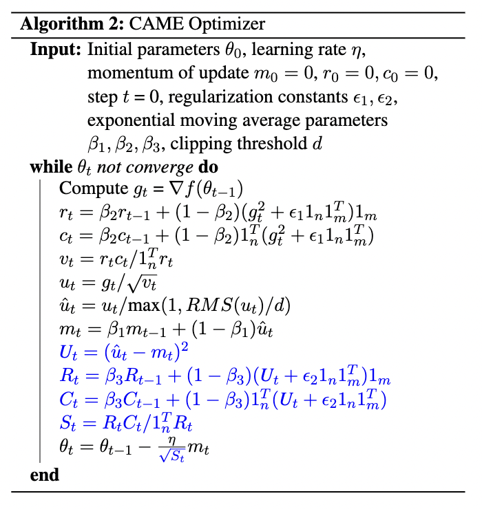

<h1 align="center">CAME Optimizer</h1>
<h3 align="center">ACL 2023 Outstanding Paper Award<br/>Confidence-guided Adaptive Memory Efficient Optimization</h3>


This is an official implementation of **CAME** optimizer in the "[Confidence-guided Adaptive Memory Efficient Optimization](https://arxiv.org/abs/2307.02047)". Please cite the paper and star this repo if you find CAME useful. Thanks!

[Paper](https://arxiv.org/abs/2307.02047) | [Twitter](https://twitter.com/ZangweiZheng/status/1680227732788236289) | [Blog](https://zhengzangw.github.io/blogs/came) | [Pypi Package](https://pypi.org/project/came-pytorch/) | [zhihu](https://zhuanlan.zhihu.com/p/643816029)
## Method

In this work, we studied a confidence-guided strategy to reduce the instability of existing memory efficient optimizers. Based on this strategy, we proposed CAME to simultaneously achieve two goals: fast convergence as in traditional adaptive methods, and low memory usage as in memory-efficient methods.

The pseudo code is presented in the figure with difference with Adafactor in blue fonts.

<p align="center">

</p>
<!--  -->

## Install 
```
pip install came-pytorch
```
## Usage

```python
from came_pytorch import CAME
optimizer = CAME(
    model.parameters(),
    lr=2e-4,
    weight_decay=1e-2,
    betas=(0.9, 0.999, 0.9999),
    eps=(1e-30, 1e-16)
)
```

## Hyper-parameter Tuning

* Pre-training: Based on our experiments on BERT-Large, GPT-2 and T5, it's suitable to choose a learning rate for CAME 3-1x smaller than that for AdamW.
* Consider choosing $\beta_3$ between $[0.9995, 0.99995]$ if setting $\beta_1, \beta_2=0.9, 0.999$. Due to computational resource constraints, we did not explore more combinations of three betas. Different training tasks may require different combinations of optimal performance.
* If you have any feedback or comments regarding hyper-parameter tuning, please do not hesitate to provide them to us!

## Experiments

Apart from the BERT and T5 experiments shown in the paper, we conduct more and record the results here.

### Fine-tuning LLaMA-7B

|                | MMLU      | WikiText | HellaSwag | TruthfulQA (MC) | BoolQ     | COPA      | WSC       | WIC       |
| -------------- | --------- | -------- | --------- | --------------- | --------- | --------- | --------- | --------- |
| Alpaca-7B      | 40.21     | 6.74     | 59.76     | **38.89**       | **79.57** | **88.00** | 46.15     | 49.84     |
| Alpaca-7B-CAME | **40.59** | **6.38** | **59.80** | 38.61           | 79.08     | **88.00** | **49.04** | **50.78** |

We fine-tuned LLaMA-7B with [stanford-alpaca](https://github.com/tatsu-lab/stanford_alpaca) (52k instruction-tuning dataset). To replicate our result, first register the CAME optimizer to the transformer package. Then in Alpaca training script, change the default optimizer from "adamw" to "came".

Alpaca-7B and Alpaca-7B-CAME are evaluated using [Instruct-eval](https://github.com/declare-lab/instruct-eval) and [lm-evaluation-harness](https://github.com/EleutherAI/lm-evaluation-harness).

### Pre-training GPT-2


The pre-training of GPT-2 (Medium, 345M) is based on [Megatron-LM](https://github.com/NVIDIA/Megatron-LM). To replicate our result, add the CAME optimizer in [`megatron/optimizer/__init__.py`](https://github.com/NVIDIA/Megatron-LM/blob/main/megatron/optimizer/__init__.py) and set the *args.optimizer* to "came".

## Memory Usage Comparison
To ensure a fair comparison, we set the batch size to 1 for the pre-training of GPT-2 (Medium) to examine the memory footprint of CAME and AdamW.

|              | AdamW | CAME     | 
|--------------|-------|----------|
| Memory (GiB) | 8.77  | **7.44** | 

## Citation

```bibtex
@inproceedings{luo2023came,
  title={CAME: Confidence-guided Adaptive Memory Efficient Optimization},
  author={Luo, Yang and Ren, Xiaozhe and Zheng, Zangwei and Jiang, Zhuo and Jiang, Xin and You, Yang},
  booktitle={Proceedings of the 61st Annual Meeting of the Association for Computational Linguistics (Volume 1: Long Papers)},
  pages={4442--4453},
  year={2023}
}
```
