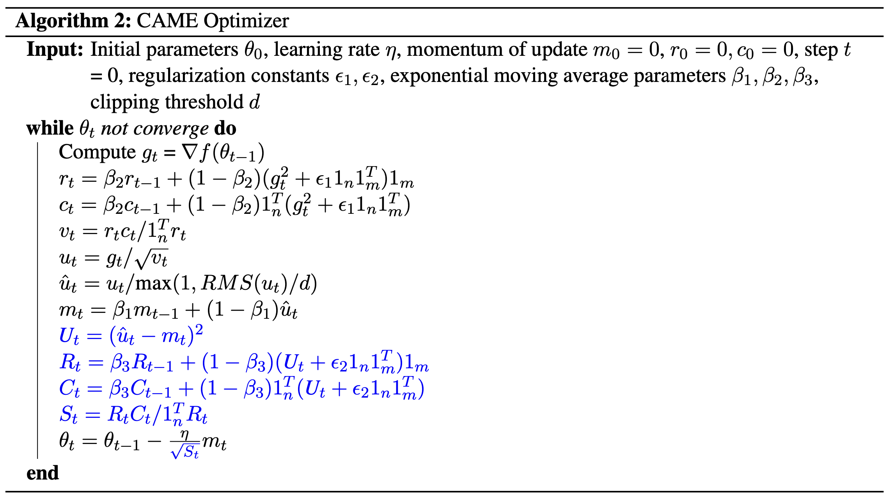
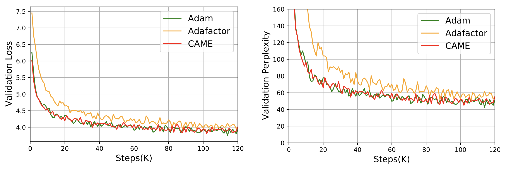

# CAME 

This repository provides a script and recipe to train the BERT model with our proposed CAME optimizer in:

CAME: Confidence-guided Adaptive Memory Efficient Optimization

This work has been accepted by ACL2023 main conference (***Outstanding Paper Award***).

In this work, we studied a confidence-guided strategy to reduce the instability of existing memory efficient optimizers. Based on this strategy, we proposed CAME to simultaneously achieve two goals: fast convergence as in traditional adaptive methods, and low memory usage as in memory-efficient methods.

# Install
``` 
pip install came_pytorch
```

# Usage
```
from came_pytorch import CAME
optimizer = CAME(model.parameters(), lr=2e-4, weight_decay=1e-2, betas=(0.9, 0.999, 0.9999), eps=(1e-30, 1e-16))
```


# Experimental Results for Some Language Models

## LLaMA-7B Fine-tune --- Alpaca-7B

|                | MMLU      | BBH       | WikiText | Hellaswag | TruthfulQA (MC) | BoolQ     | COPA  | WSC       | WIC       |
|----------------|-----------|-----------|----------|-----------|-----------------|-----------|-------|-----------|-----------|
| Alpaca-7B      | 40.21     | **33.97** | 6.74     | 59.76     | **38.89**       | **79.57** | 88.00 | 46.15     | 49.84     | 
| Alpaca-7B-CAME | **40.59** | 33.42     | **6.38** | **59.80** | 38.61           | 79.08     | 88.00 | **49.04** | **50.78** |

## GPT-2 Pre-train



# Citation
```
@inproceedings{luo-etal-2023-came,
    title = "{CAME}: Confidence-guided Adaptive Memory Efficient Optimization",
    author = "Luo, Yang  and
      Ren, Xiaozhe  and
      Zheng, Zangwei  and
      Jiang, Zhuo  and
      Jiang, Xin  and
      You, Yang",
    booktitle = "Proceedings of the 61st Annual Meeting of the Association for Computational Linguistics (Volume 1: Long Papers)",
    month = jul,
    year = "2023",
    address = "Toronto, Canada",
    publisher = "Association for Computational Linguistics",
    url = "https://aclanthology.org/2023.acl-long.243",
    pages = "4442--4453",
    abstract = "Adaptive gradient methods, such as Adam and LAMB, have demonstrated excellent performance in the training of large language models. Nevertheless, the need for adaptivity requires maintaining second-moment estimates of the per-parameter gradients, which entails a high cost of extra memory overheads. To solve this problem, several memory-efficient optimizers (e.g., Adafactor) have been proposed to obtain a drastic reduction in auxiliary memory usage, but with a performance penalty. In this paper, we first study a confidence-guided strategy to reduce the instability of existing memory efficient optimizers. Based on this strategy, we propose CAME to simultaneously achieve two goals: fast convergence as in traditional adaptive methods, and low memory usage as in memory-efficient methods. Extensive experiments demonstrate the training stability and superior performance of CAME across various NLP tasks such as BERT and GPT-2 training. Notably, for BERT pre-training on the large batch size of 32,768, our proposed optimizer attains faster convergence and higher accuracy compared with the Adam optimizer. The implementation of CAME is publicly available.",
}
```
